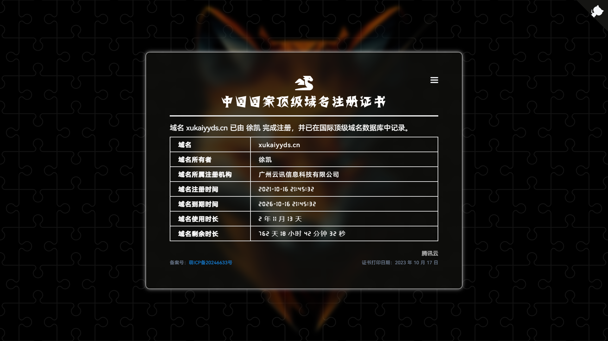
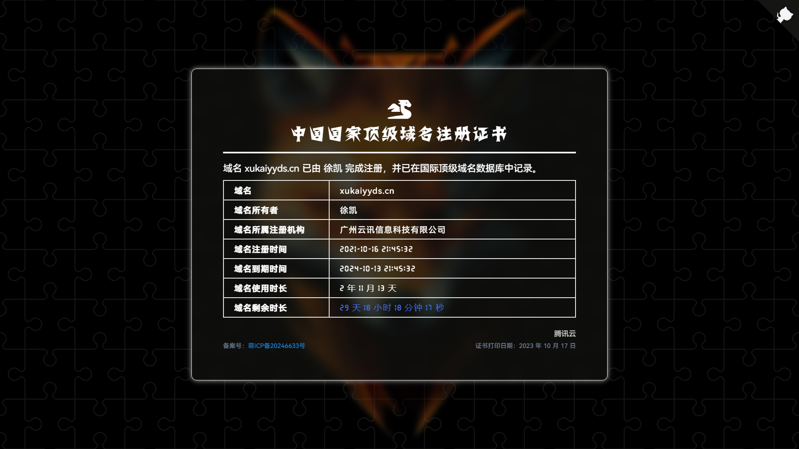
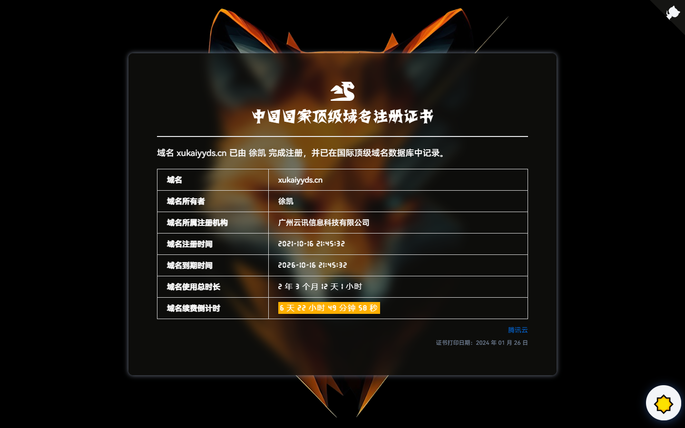
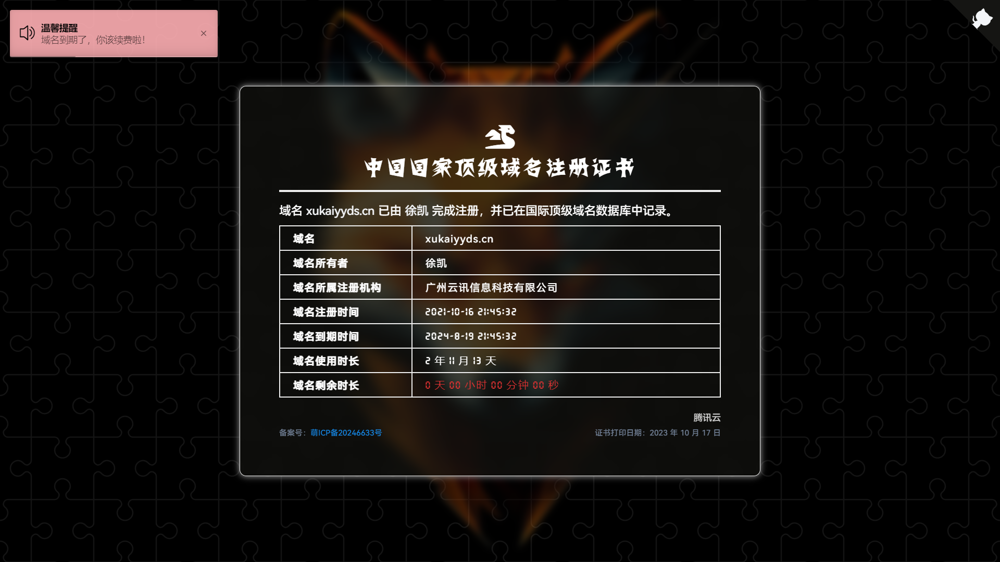

## domain-name

一个简约的网页版顶级国际域名证书，方便自己或他人查看你的域名使用时长以及域名剩余时长。

查看演示

域名到期前一个月以上：

域名到期前一个月：

域名到期前一个星期：

域名到期后：

### 预览

- [Demo1 - Netlify 正常线路](https://domains.xukaiyyds.cn)
- [Demo2 - Vercel 备用线路](https://count.xukaiyyds.cn)

### 使用

直接`Fork`本仓库，然后将首页`index.html`中的``部分改为你自己的域名信息即可。

### 特征

- [x] 响应式设计
- [x] 移动端适配
- [x] 个性化配置

### 功能

- [x] 浅色主题
- [x] 操作反馈
- [x] 分享证书

功能部分对应用到了以下插件：

- [Darkmode.js](https://github.com/sandoche/Darkmode.js)
- [iziToast.js](https://github.com/marcelodolza/iziToast)
- [Share.js](https://github.com/overtrue/share.js)

### 鸣谢

项目灵感来源于腾讯云的[顶级国际域名证书](img/certificate/xukaiyyds.cn.old-certificate.jpg)。

设计灵感借鉴于：<https://icp.gov.moe/?keyword=20246633>

如果觉得这个项目还不错的话，请给我一个 **Star** 支持一下，这对我很重要，谢谢 ~
