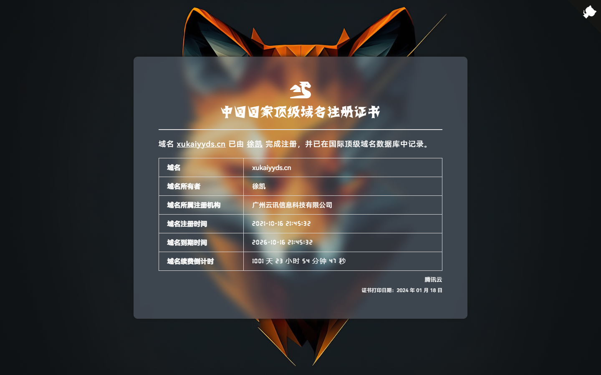
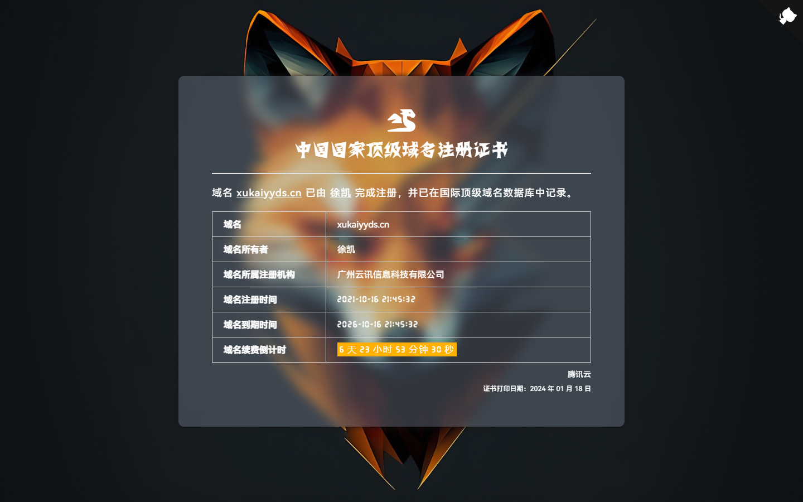

## 域名证书

### 简介

一个简约的高仿版顶级国际域名证书，方便自己或他人随时查看你的域名到期时间。

<small>域名到期前：</small>



<small>域名到期前一个月：</small>


<small>域名到期前一个星期：</small>



<small>域名到期后：</small>


当然，你也可以考虑像我一样，将它放入到你的个人主页或个人博客的页脚信息中，相信我，到时候会有好心人来提醒你及时续费的（bushi）。

咳咳，是及时续费还是及时止损？这是个值得我们思考的问题！

### 预览

<https://count.xukaiyyds.cn>

### 使用

直接克隆本仓库，然后将域名注册信息改为你自己的即可。

```bash
git clone git@github.com:xukaiyyds/domain-name.git
```

### 功能（计划开发中）

- 显示域名续费倒计时 ✅
- 根据域名续费倒计时显示不同的颜色提醒 ✅
- 添加夜间模式
- 添加下载证书
- 加载动画只允许加载一次
- 响应式设计
- 移动端适配

### 鸣谢

项目灵感来源于[腾讯云](https://cloud.tencent.com)的[中国国家顶级域名注册证书](img/certificate/xukaiyyds.cn.certificate.jpg)和[顶级国际域名证书](img/certificate/xukaiyyds.cn.old-certificate.jpg)。

设计灵感借鉴于：

- <https://icp.gov.moe/?keyword=20220462>
- <https://50projects50days.com/projects/blurry-loading/>

如果大家觉得还不错的话，请给我一个 Star 鼓励一下，谢谢 ~
