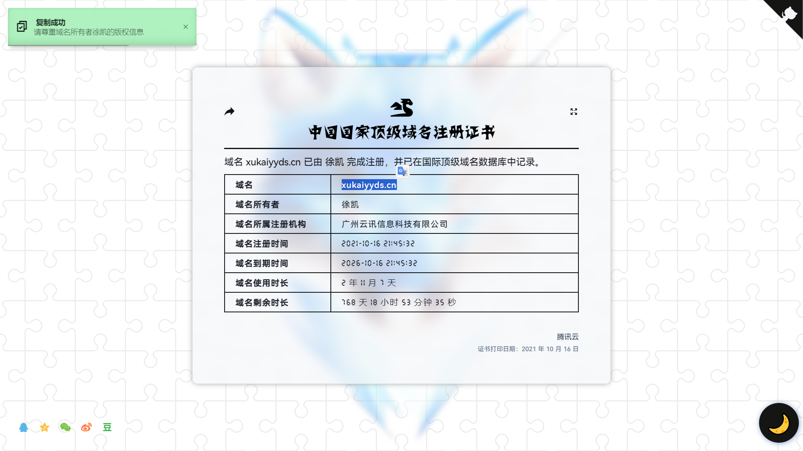
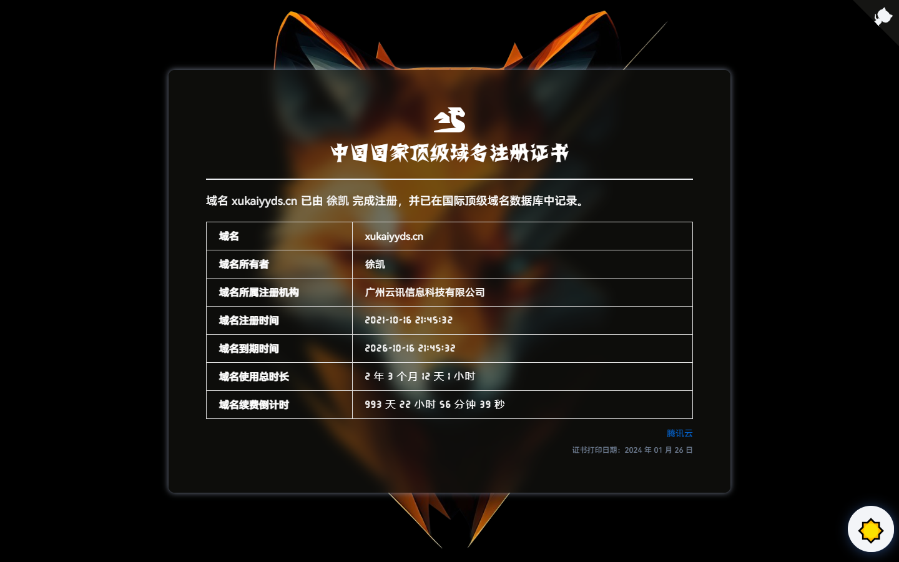

## 域名证书

一个简约的高仿版顶级国际域名证书，方便自己或他人随时查看你的域名到期时间以及详细域名信息。

### 演示

浅色模式：



深色模式：



域名到期前一个月：


域名到期前一个星期：


域名到期后：


当然，你也可以考虑像我一样，将它放入到你的个人主页或个人博客中，相信我，到时候会有好心人来提醒你及时续费的（bushi）。

咳咳，是及时续费还是及时止损？这是个值得我们认真思考的问题！

### 预览

- [Demo1 - Vercel 线路](https://domain.xukaiyyds.cn)
- [Demo2 - Netlify 线路](https://count.xukaiyyds.cn)

### 使用

直接克隆本仓库，然后将`index.html`的域名信息改为你自己的即可（在下面的`<script></script>`部分改）。

```bash
git clone git@github.com:xukaiyyds/domain-name.git
```

### 特征

- 响应式设计 ✅
- 精确计算域名使用时间和域名续费倒计时 ✅
- 根据域名续费倒计时显示不同的颜色提醒 ✅

### 功能

- 深色模式 ✅
- 中英文翻译
- 个性化设置
  - 是否禁用深色模式
  - 是否取消背景图片

### 鸣谢

项目灵感来源于[腾讯云](https://cloud.tencent.com)的[中国国家顶级域名注册证书](img/certificate/xukaiyyds.cn.certificate.jpg)和[顶级国际域名证书](img/certificate/xukaiyyds.cn.old-certificate.jpg)。

设计灵感借鉴于：

- <https://icp.gov.moe/?keyword=20220462>
- <https://50projects50days.com/projects/blurry-loading/>

我使用的小插件：

- [Pace.js](https://github.com/CodeByZach/pace)
- [Darkmode.js](https://github.com/sandoche/Darkmode.js)

如果大家觉得这个项目还不错的话，请给我一个 **Star** 鼓励一下，这对我很重要，谢谢 ~
