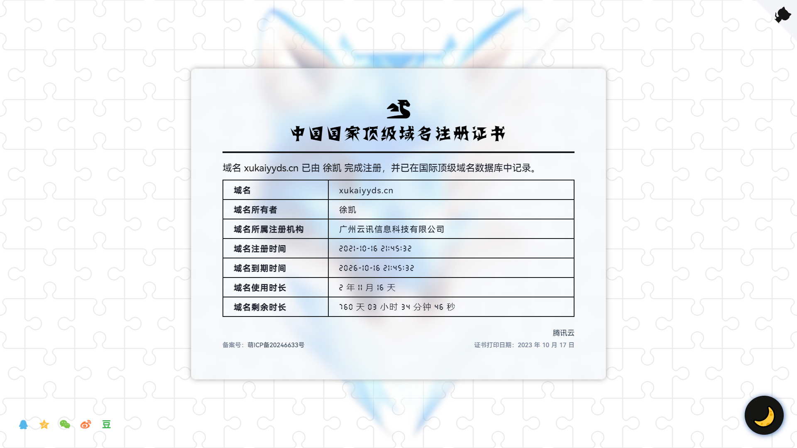

## 域名证书

一个简约的网页版顶级国际域名证书，方便自己或他人随时查看你的域名剩余时长以及域名详细信息。

### 演示

<details>
<summary>点击展开</summary>

浅色模式：



深色模式：


域名到期前一个月：


域名到期前一个星期：


域名到期后：


</details>

### 预览

- [Demo1 - Netlify 正常线路](https://domains.xukaiyyds.cn)
- [Demo2 - Vercel 备用线路](https://count.xukaiyyds.cn)

### 使用

直接克隆本仓库，然后将`index.html`的域名信息改为你自己的即可（在下面的`<script></script>`部分改）。

```bash
git clone git@github.com:xukaiyyds/domain-name.git
```

### 特征

- 载入动画 ✅
- 响应式设计 ✅
- 移动端适配 ✅
- 精确计算域名的使用时长和剩余时长 ✅
- 根据域名的剩余时长进行相应的提醒 ✅

### 功能

- 深色模式 ✅
- 分享证书 ✅
- 全屏显示 ✅
- 中英文切换
- 个性化配置

### 鸣谢

- [Pace.js](https://github.com/CodeByZach/pace)
- [Darkmode.js](https://github.com/sandoche/Darkmode.js)
- [iziToast](https://github.com/marcelodolza/iziToast)
- [Share.js](https://github.com/overtrue/share.js)

项目灵感来源于[腾讯云](https://cloud.tencent.com)的[顶级国际域名证书](img/certificate/xukaiyyds.cn.old-certificate.jpg)。

设计灵感借鉴于：<https://icp.gov.moe/?keyword=20220462>

如果大家觉得这个项目还不错的话，请给我一个 **Star** 鼓励一下，这对我很重要，谢谢 ~
